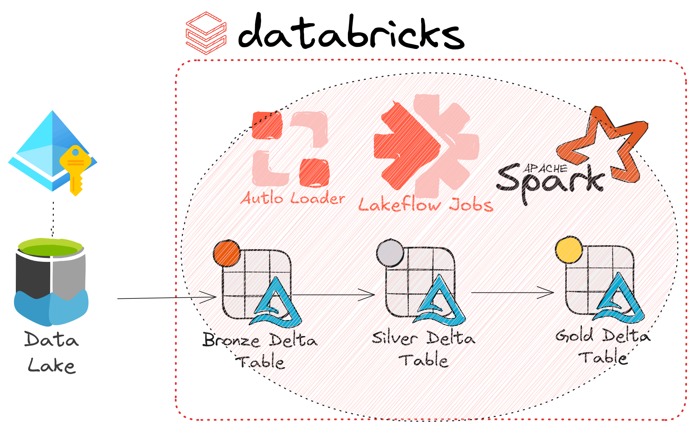
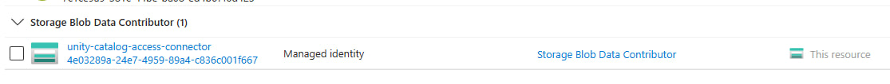
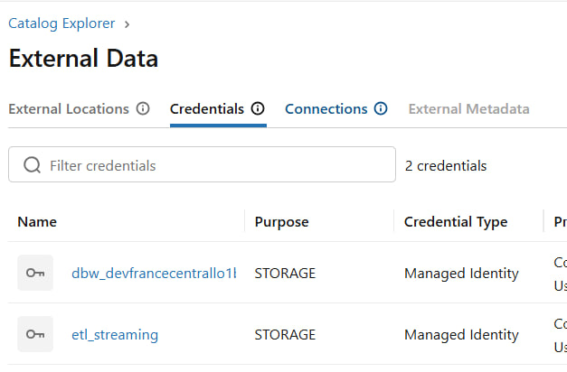
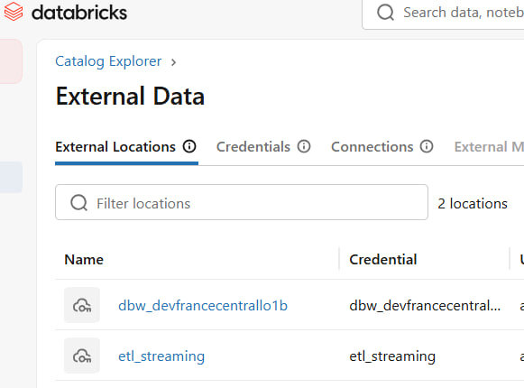
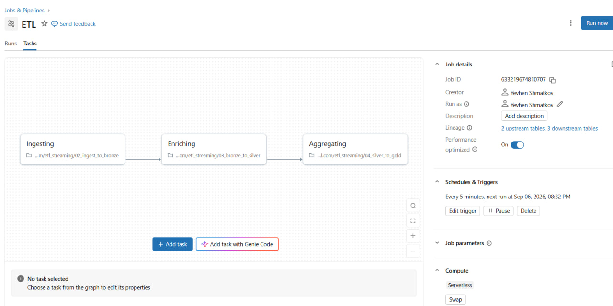
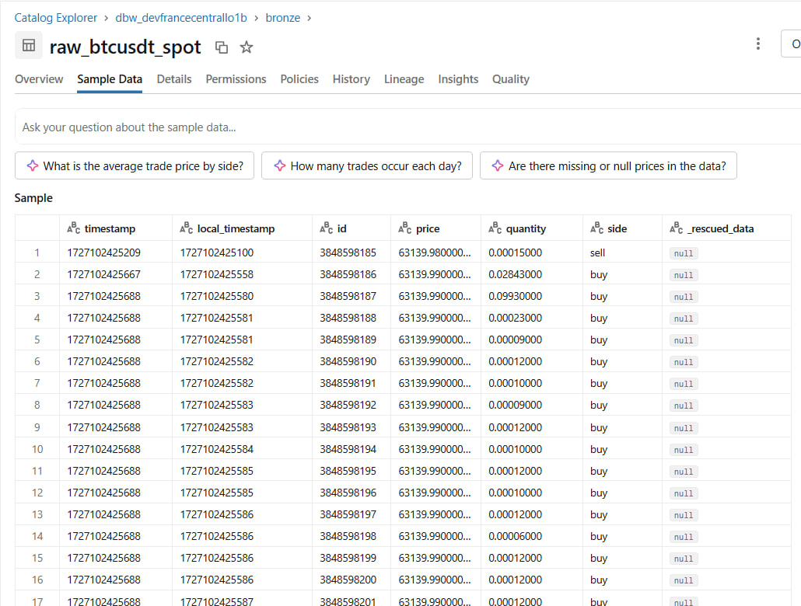
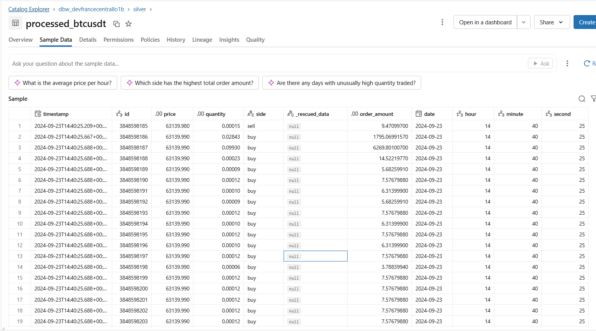
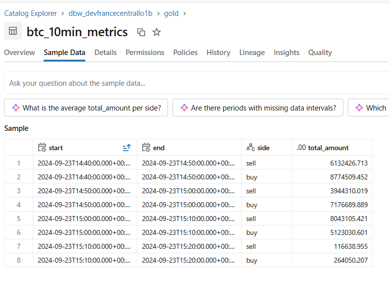

Build icremental streaming data pipeline orchestrated with lakeflow job, implementing the Medallion architecture on Azure Databricks, provisioned using Terraform (IaC)

Source of dataset: https://www.kaggle.com/datasets/circeukan/binance-trading-events?utm_source=chatgpt.com&select=btcusdt.spot.trades.csv

Combining Spark Structured Streaming on a `5-minute-trigger` schedule delivers the benefits of incremental streaming and 10min watermarks for `late/out of order` data arrival and cleaning state for 10-min tumbling window aggregations.

Used checkpoints for storing state, fault tolerance and incremental processing with `AutoLoader`.
Configured `foreachBatch` for idempotent table writes with update mode ensuring exactly-once processing, allowing failed tasks and retries to resume without creating duplicate records.

Configured keyless access to Azure Data Lake Storage Gen2 using Azure Managed Identity, governed by Databricks Unity Catalog External Locations and Storage Credentials.

Raw trading data is transformed from schema-less CSV dumps into clean, ACID-compliant Delta tables with schema enforcement and catching malformed records into `__rescued_data` column.

